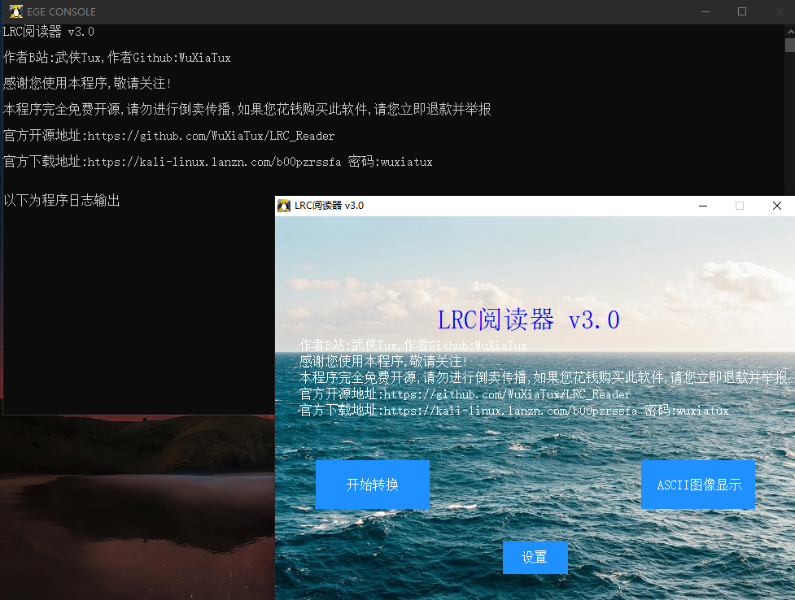

[中文](https://github.com/WuXiaTux/LRC_Reader/blob/main/README.md) [English](https://github.com/WuXiaTux/LRC_Reader/blob/main/README_ENGLISH.md)
# LRC阅读器 
 
### 本软件支持的系统和软件： 
本软件目前仅支持Windows7及其以上Windows版本，支持32位和64位系统，支持中文和英文  
### 本软件的详细功能介绍： 
1.将TXT文件转为LRC文件，再根据TXT行数用FFMPEG生成与文件行数相同的MP3文件。 
(1)文件分割模式：会将TXT文件以500行为一组分割，再生成对应的MP3文件。 
（使用500行的原因是因为我使用的MP3最大限制为500行，如果你想替换可以自己修改然后编译） 
2.将图片文件导入ascii-image-converter，生成一个TXT文件，然后将这个TXT转为LRC文件和MP3文件的组合，在MP3上显示ASCII图片（仅支持不为滚动播放歌词的播放器）  
### 开发和重新编译本软件需注意点： 
1.我的电脑系统为Windows10 LTSC 10.0.19044 内部版本 19044 64位。 
2.本软件使用C++编写，使用了EGE图形库，使用小熊猫C++(IDE)开发，因此建议您也[下载此IDE](http://royqh.net/redpandacpp/download/)以更加便利地开发软件。 
3.为了适配32位电脑，请勿替换FFMPEG，因为FFMPEG官方已不再支持32位电脑，只能使用此版本，而且更改ascii-image-converter也请注意使用32位版本。 
4.这是我使用的编译选项： 
g++.exe -c main.cpp -o main.o   -O2 -pipe -lwinmm -std=c++17 -lComdlg32  -finput-charset=UTF-8 -fexec-charset=gbk  
windres.exe -i v3_private.rc --input-format=rc -o v3_private.res -O coff  
g++.exe main.o v3_private.res -o v3.0.exe -mwindows -s -mwindows -lgraphics -luuid -lmsimg32 -lgdi32 -limm32 -lole32 -loleaut32 -lwinmm -lgdiplus -static 